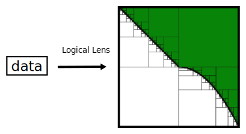
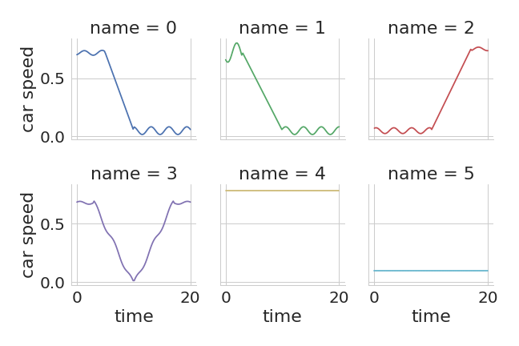

[](https://travis-ci.org/mvcisback/LogicalLens)
[](https://codecov.io/gh/mvcisback/LogicalLens)
[](https://pyup.io/repos/github/mvcisback/LogicalLens/)

[](https://badge.fury.io/py/LogicalLens)
[](https://opensource.org/licenses/MIT)

# LogicalLens

A "logical lens" is a map: `f : Data -> ([0, 1]^n -> bool)` and is
interpreted as a family of properties over the hyper unit box, `[0,
1]^n`, indexed by "`Data`". Further, `f(data)` must be monotonic threshold
function. That is, given a fixed data `data`, the map `g = f(data)` is
such that for any two points in the unit box, `x, y in [0, 1]^n` if `x
<= y` coordinate-wise, then `g(x) <= g(y)` , where `False <= True`. An
example is given below (see
[monotone-bipartition](https://github.com/mvcisback/monotone-bipartition)
for details):

<figure>
  
</figure>

In principle, `Data` can be anything from time-series to pictures of
dogs. The key idea is that a logical lens using embedding
domain specific knowledge in the form of property tests
to design features and similarity measures.

For details on this formalism, see the following two papers or [this slide deck](https://mjvc.me/RV2018/):

1. [Vazquez-Chanlatte, Marcell, et al."Time Series Learning using Monotonic Logical Properties.", International Conference on Runtime Verification, RV, 2018](https://mjvc.me/papers/rv2018_logical_ts_learning.pdf)

1. [Vazquez-Chanlatte, Marcell, et al. "Logical Clustering and Learning for Time-Series Data." International Conference on Computer Aided Verification. Springer, Cham, 2017.](https://mjvc.me/papers/cav2017.pdf)

# Usage

## Example Dataset
We begin by defining a dataset. Here we focus on some toy "car speeds"
with the goal of detecting traffic "slow downs" (see below). While a
bit contrived, this example will illustrate the common workflow of
this library.

<figure>
  
</figure>

This dataset is provided in `example_data/toy_car_speeds`. Below, we
assume that `data` is a list of the 6 *piece-wise constant* time
series, where each element is a sequence of `(timestamp, value)`
pairs. For example,

```python
print(data[5])  # [(0, 0.1)]
```

Code for loading the data is given in `example/toy_car_speeds/load.py`.

## Example Specification

We can now define a monotonic parametric properties we are interested
in testing. To continue our example, let us test if the car's speed is
remains below some value `h` after time `tau`.

```python
def slow_down_lens(h, tau):
    tau *= 20
    return lambda data: all(speed < h for t, speed in data if t >= tau)
```

Since we require each parameter to be between `0` and `1`, we rescale
`tau` to be between `0` and `20` internally. Further, because the
car's speed is already normalized between `0` and `1`, `h` does not
need to change.

Finally, before moving on, notice that `slow_down_lens` is indeed
monotonic since increasing `h` and `tau` both make the property easier
to satisfy.

### Aside
For more complicated specifications using temporal logic, we recommend
using the
[metric-temporal-logic](https://github.com/mvcisback/py-metric-temporal-logic)
library.

## Example Usage

We are finally ready to use the `logical_lens` library.  We begin by
bringing the `LogicalLens` class into scope.  This class wraps a
mathematical logical lens into an easy to use object.

```python
from logical_lens import LogicalLens

lens = LogicalLens(lens=slow_down_lens)
```

Under this lens, the time series become threshold surfaces in the
2-d unit box.

<figure>
  
</figure>

We can now compute the induced "Logical Distance"
(hausdorff distance of boundaries) between datum.
```python
# Compute Logical Distances.
d = lens.dist(data[0], data[1])
A = lens.adj_matrix(data=data)  # Compute full adjacency matrix.

```python

# Find points on boundaries for coarse estimates.

## Find intersection of threshold surface and
## the lines intersecting the origin and the points
## provided.
f = lens.projector([(0, 1), (1, 0.3)])
Y = map(f, [x1, x2])

## Project onto 10 random lines.
f2 = lens.random_projector(10)

## Project using lexicographic ordering of parameters:
f3 = lens.lex_projector(orders=[
   [(1, False), (0, True)],  # minimizing on axis 1 then maximizing on axis 0.
   [(0, False), (1, False)],  # minimizing on axis 0 then minimizing on axis 1.
])

```

TODO: rewrite for LogicalLens:
Example notebook used in RV2018 submission: https://gist.github.com/mvcisback/e339530f90a380ad1b36ed4e2291c988
